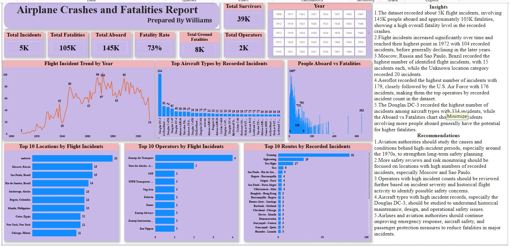

# Airplane Crashes & Fatalities Analysis

**Tools:** Power BI • Power Query • DAX

## Project Overview
Built an aviation incident dashboard to analyse crash trends, fatalities, aircraft types, operators, locations and incident categories.

## Key Result
Analysed 5K+ recorded incidents, about 145K people aboard and 105K fatalities. The dashboard highlighted a 73% fatality rate, the 1972 incident peak, and concentration among selected aircraft types and operators.

## Skills Demonstrated
- Data cleaning and preparation
- KPI development
- Dashboard design
- Trend and performance analysis
- Insight generation
- Business recommendations

## Dashboard

