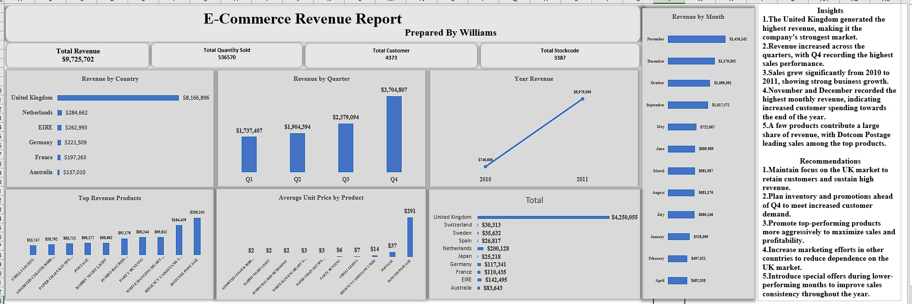

# E-Commerce Revenue Analysis

**Tools:** Microsoft Excel • PivotTables • Data Cleaning • Dashboarding

## Project Overview
Cleaned online retail transaction data and developed an Excel dashboard for revenue, quantity, customers, products, country and seasonal performance.

## Key Result
Tracked $9.73M revenue, 536K units and 4,373 customers. Identified the United Kingdom as the dominant market and Q4, especially November and December, as the strongest sales period.

## Skills Demonstrated
- Data cleaning and preparation
- KPI development
- Dashboard design
- Trend and performance analysis
- Insight generation
- Business recommendations

## Dashboard

