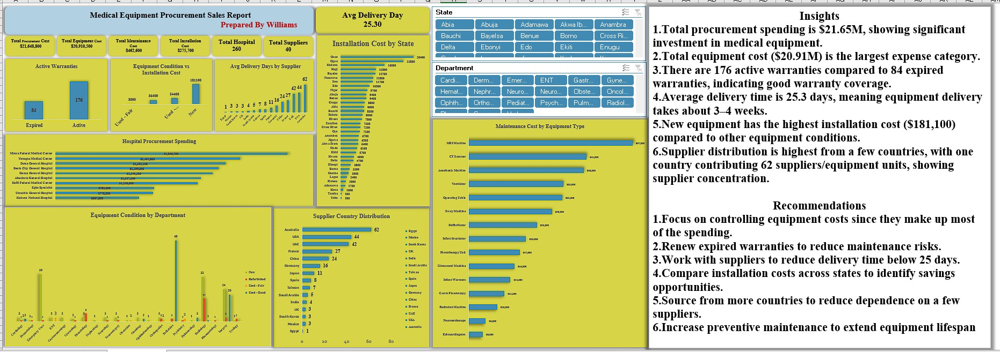

# Medical Equipment Procurement Analysis

**Tools:** Microsoft Excel • PivotTables • Dashboarding

## Project Overview
Built a procurement dashboard to monitor equipment cost, installation cost, warranties, delivery time, departments and supplier concentration.

## Key Result
Analysed $21.65M procurement spend and $20.91M equipment cost. Found an average delivery time of 25.3 days and 176 active versus 84 expired warranties.

## Skills Demonstrated
- Data cleaning and preparation
- KPI development
- Dashboard design
- Trend and performance analysis
- Insight generation
- Business recommendations

## Dashboard

