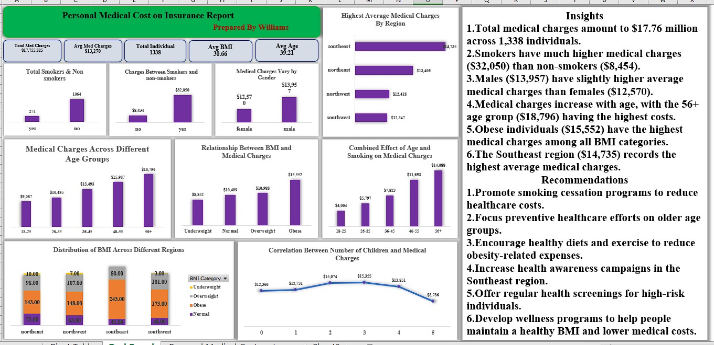

# Personal Medical Cost & Insurance Analysis

**Tools:** Microsoft Excel • PivotTables • Dashboarding

## Project Overview
Analysed medical charges across smoking status, age, gender, BMI and region to identify major cost drivers.

## Key Result
Analysed $17.76M in charges across 1,338 individuals. Smokers averaged $32,050 in medical charges versus $8,454 for non-smokers, while the 56+ and obese groups recorded the highest costs.

## Skills Demonstrated
- Data cleaning and preparation
- KPI development
- Dashboard design
- Trend and performance analysis
- Insight generation
- Business recommendations

## Dashboard

