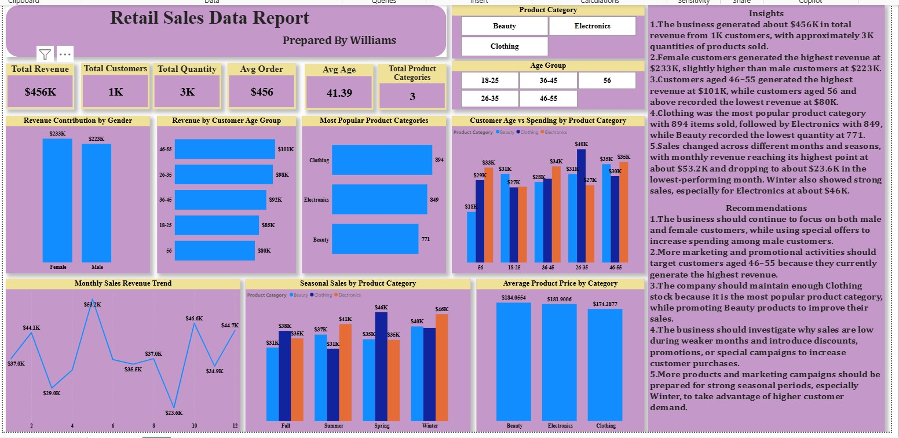

# Retail Sales Analysis

**Tools:** Power BI • Power Query • DAX

## Project Overview
Developed a retail dashboard to analyse revenue by gender, age group, category, month and season.

## Key Result
Tracked about $456K revenue from 1K customers and roughly 3K units sold. Customers aged 46–55 generated the highest revenue, while Clothing led product quantity.

## Skills Demonstrated
- Data cleaning and preparation
- KPI development
- Dashboard design
- Trend and performance analysis
- Insight generation
- Business recommendations

## Dashboard

