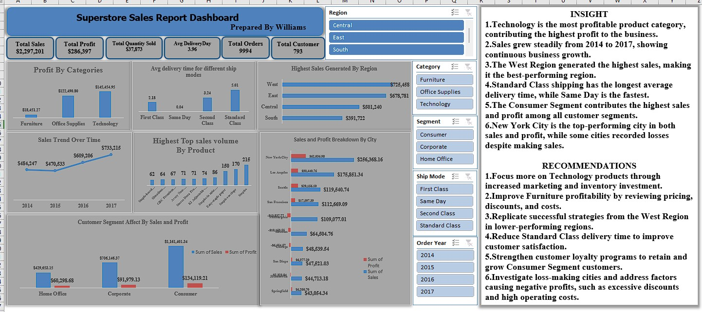

# Superstore Sales & Profitability Analysis

**Tools:** Microsoft Excel • PivotTables • PivotCharts • Dashboarding

## Project Overview
Analysed retail sales, profit, region, segment, city and shipping performance in an interactive Excel report.

## Key Result
Identified Technology as the most profitable category, the West as the strongest region, Consumer as the leading segment and New York City as the top-performing city.

## Skills Demonstrated
- Data cleaning and preparation
- KPI development
- Dashboard design
- Trend and performance analysis
- Insight generation
- Business recommendations

## Dashboard

