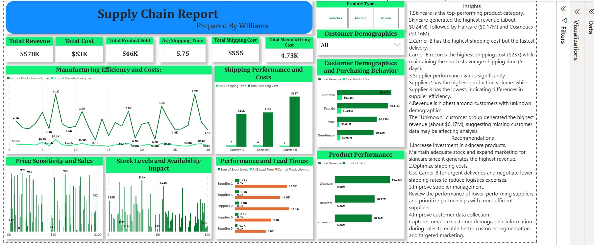

# Supply Chain Performance Analysis

**Tools:** Power BI • Power Query • DAX

## Project Overview
Created a supply chain dashboard covering product revenue, shipping time and cost, supplier output and customer data quality.

## Key Result
Tracked about $578K revenue and identified skincare as the top product category. The analysis also exposed shipping cost/speed trade-offs and missing demographic data affecting customer analysis.

## Skills Demonstrated
- Data cleaning and preparation
- KPI development
- Dashboard design
- Trend and performance analysis
- Insight generation
- Business recommendations

## Dashboard

