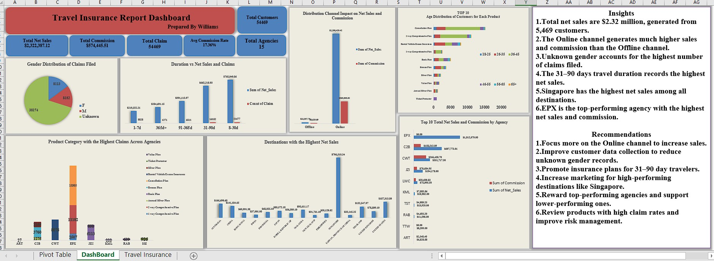

# Travel Insurance Performance Analysis

**Tools:** Microsoft Excel • PivotTables • Data Cleaning • Dashboarding

## Project Overview
Analysed insurance sales, commissions, claims, agencies, channels, destinations, customer age and travel duration.

## Key Result
Tracked $2.32M net sales from 5,469 customers. Online sales dominated, Singapore led destination revenue and EPX emerged as the top-performing agency.

## Skills Demonstrated
- Data cleaning and preparation
- KPI development
- Dashboard design
- Trend and performance analysis
- Insight generation
- Business recommendations

## Dashboard

